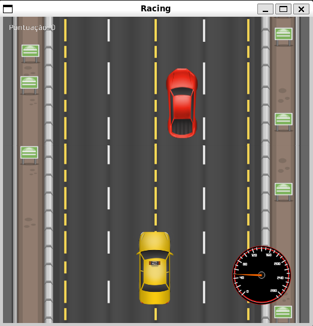

# Ruby Rush

**Ruby Rush** is a racing game developed in [Ruby](https://www.ruby-lang.org/en/documentation/) using the [Gosu](https://www.libgosu.org/) gem.

## Getting Started

After installing Ruby and Gosu, you should be able to run [racing.rb](https://github.com/douglas-vitoriano/ruby_rush/blob/main/racing.rb)

## Author

- *Douglas* - [@douglas-vitoriano](https://github.com/douglas-vitoriano)

## License
This project is licensed under the MIT License. See the [LICENSE](https://github.com/douglas-vitoriano/ruby_rush/blob/main/LICENSE) file for details.
